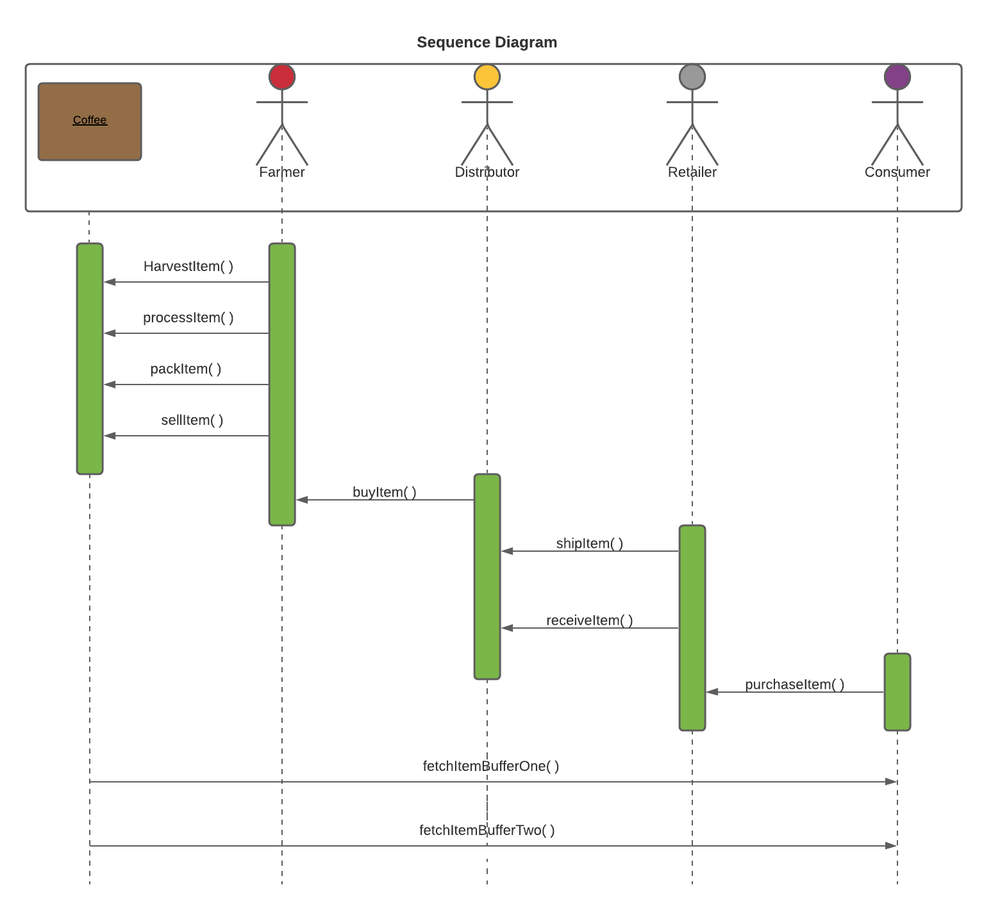
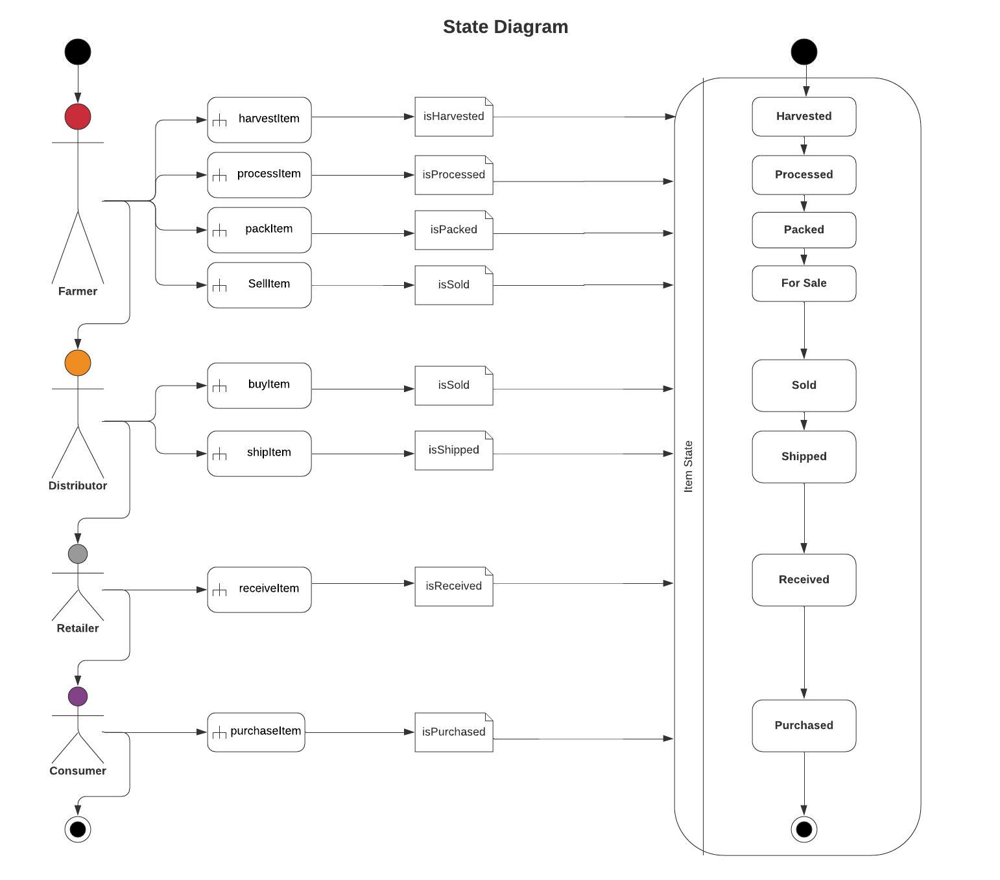
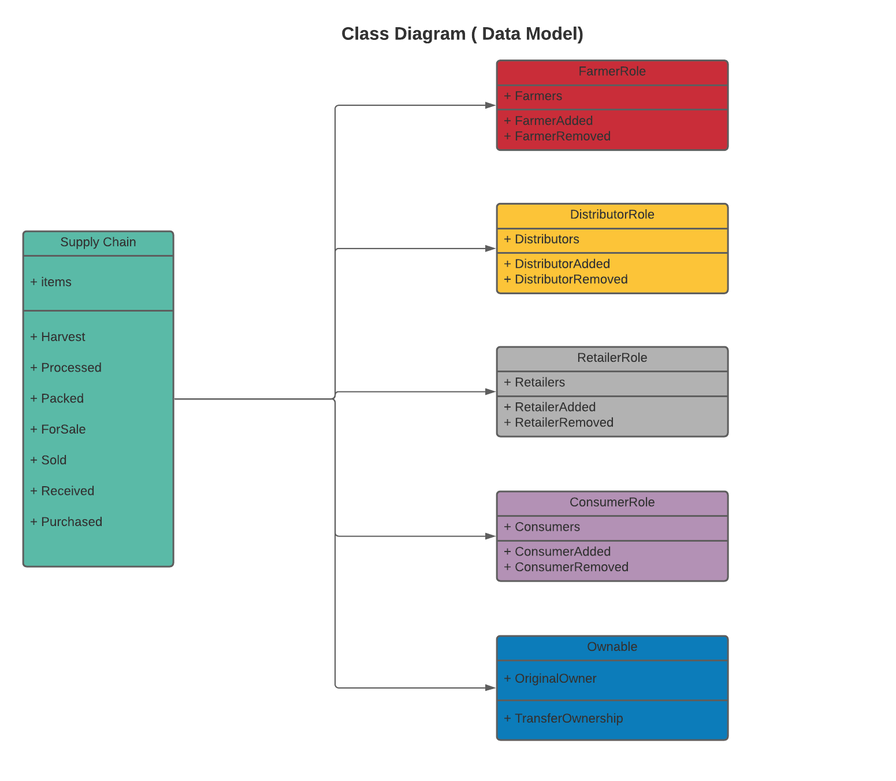
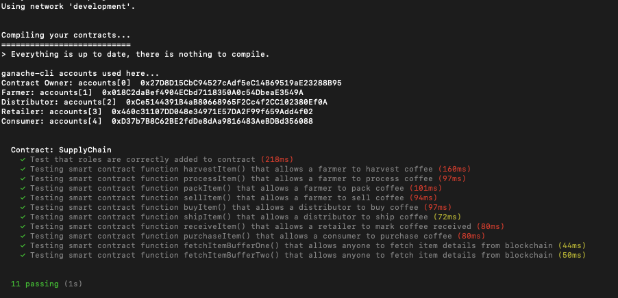
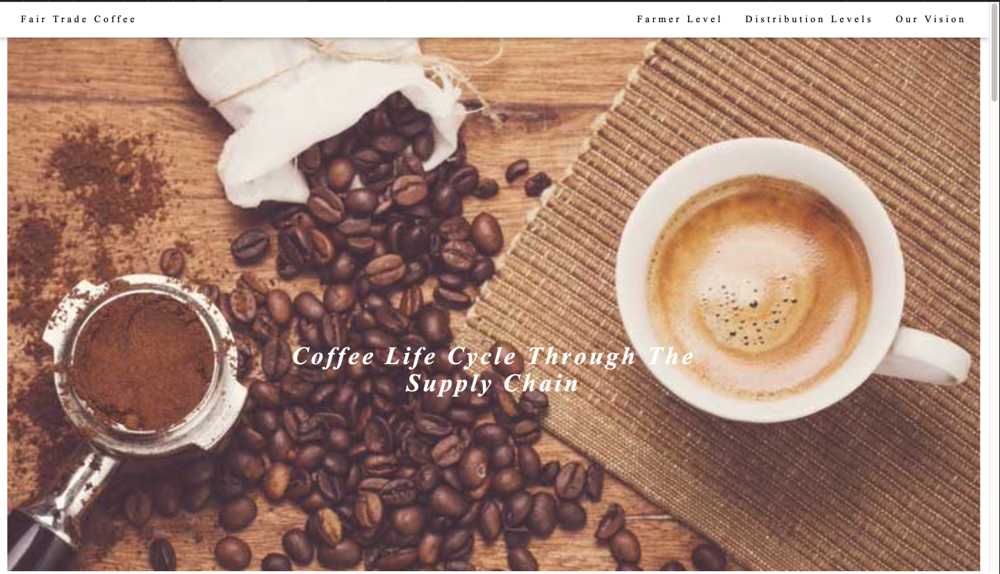

# Supply chain & data auditing

This repository containts an Ethereum DApp that demonstrates a Supply Chain flow between a Seller and Buyer. The user story is similar to any commonly used supply chain process. A Seller can add items to the inventory system stored in the blockchain. A Buyer can purchase such items from the inventory system. Additionally a Seller can mark an item as Shipped, and similarly a Buyer can mark an item as Received.

### General Project Write-up
Building this project, I worked on 5 distinct parts:

# Part 1 - Plan the project:
 I made UML diagrams and described the libraries that I chose to use and why I chose to use them
### UML Diagrams

As part of the project planning, I used the online tool Lucid app to create the diagrams needed for this project.  

- **Activity Diagram** 


- **Sequence Diagram** 


- **State Diagram** 


- **Class (Data Models)** 



# Part 2 - Write smart contracts:
  The project instructions came with layed out specifications on what contracts are needed.
  I added the required logic and wrote the functions needed for each individual contract. (i) `coffeAccessControl` (ii) `coffeeBase` (iii) `coffeeCore`
  - **coffeeAccessControl**

        - ConsumerRole.sol:  


        - DistributorRole.sol: 


        - FarmerRole.sol: 


        - RetailerRole.sol: 


        - Roles.sol: 

  - **coffeeBase**

        - SupplyChain.sol:

  - **coffeeCore**

        - Ownable.sol:

# Part 3 - Testing smart contract :
 I ran ```truffle compile``` to test my contracts. The code for these test are in the  ```TestSupplyChain.js``` file.
### Testing The contract by running 11 test written to call the contract's functions



## Running the application:
This can be obtained by navigating to the DApp directory and running```npm run dev ```
#### This is our landing page for the DApp




# Part 4 - Deploy smart contracts on Rinkeby TestNet:
 I used the Truffle framework and Infura to deploy my smart contracts onto the Rinkeby test network:
```


Compiling your contracts...
===========================
> Everything is up to date, there is nothing to compile.


Starting migrations...
======================
> Network name:    'development'
> Network id:      1618429825551
> Block gas limit: 6721975 (0x6691b7)


1_initial_migration.js
======================

   Deploying 'Migrations'
   ----------------------
   > transaction hash:    0x3643dcd449fd5c07879e73b512f4d298a1169dd7e62a558db06cb40a3d0dc2dc
   > Blocks: 0            Seconds: 0
   > contract address:    0xFEeCfF2CB7d6f3BfcBE5fa41c49c8fB642f2dDbF
   > block number:        1
   > block timestamp:     1618478769
   > account:             0x27D8D15CbC94527cAdf5eC14B69519aE23288B95
   > balance:             99.99616114
   > gas used:            191943 (0x2edc7)
   > gas price:           20 gwei
   > value sent:          0 ETH
   > total cost:          0.00383886 ETH


   > Saving migration to chain.
   > Saving artifacts
   -------------------------------------
   > Total cost:          0.00383886 ETH


Summary
=======
> Total deployments:   1
> Final cost:          0.00383886 ETH

```

#### The contract address Rinkeby test network: **0xFEeCfF2CB7d6f3BfcBE5fa41c49c8fB642f2dDbF** 


# Part 5 - Build the frontend:
I modified the frontend UI that allows users to interact with the smart contracts from the web using web3.js and other regular web technologies such as HTML and Css.


### Libraries Write-up
Below are the dependencies in my `packages.json` file:
```json
"dependencies": {
    "solidity-docgen": "^0.5.7",
    "truffle": "^5.1.51",
    "truffle-assertions": "^0.9.2",
    "truffle-hdwallet-provider": "^1.0.17",
    "web3": "^1.3.0"
  }
```
<!-- **Why I used each library**:
- `solidity-docgen`: I tried out using solidity docgen to generate documentation for my smart contracts.  The generated documentation is in a `gitbook` contained in the `docgen` folder.  This library might be useful for future projects as smart contract libraries can get quite complex.
- `truffle`: truffle is a development framework for Ethereum that makes it easy to compile, test, and migrate solidity contracts to Ethereum networks.  For example, I used `truffle` to deploy my smart contracts to the `Rinkeby` test network.
- `truffle-assertions`: the assertions library for truffle has convenience functions designed for solidity assertions inside of truffle tests.  I used the assertion syntax to test whether my contracts correctly emitted different events as expected.
- `truffle-hdwallet-provider`: this libarary was used to enable my truffle deployments to spend test coins from my Metamask wallet on the Rinkeby network as part of deploying my contracts to `Rinkeby`
- `web3`: -->

### IPFS Write-up
I did not use IPFS for this project.

