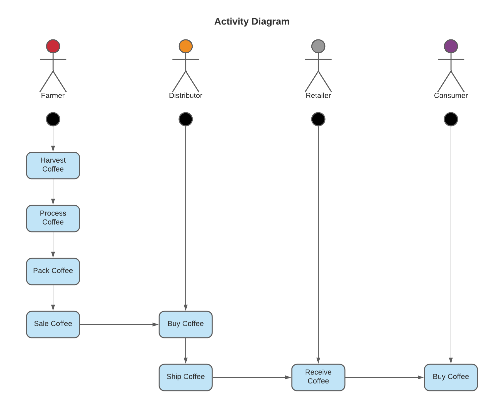

As part of the requirements: I have created the diagrams requested in the instructions:

# Supply chain & data auditing

This repository containts an Ethereum DApp that demonstrates a Supply Chain flow between a Seller and Buyer. The user story is similar to any commonly used supply chain process. A Seller can add items to the inventory system stored in the blockchain. A Buyer can purchase such items from the inventory system. Additionally a Seller can mark an item as Shipped, and similarly a Buyer can mark an item as Received.

UML Diagrams

As part of the project planning, I created UML activity, sequence, and state diagrams which are included below.

Activity Diagram

Sequence Diagram

State Diagram

Classes (Data Models)

